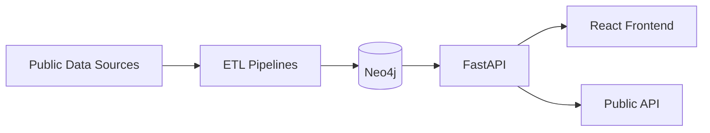

# pe/acc open graph

[](docs/brand/bracc-header.jpg)

[English](README.md) | [Portugues](docs/pt-BR/README.md)

**Open-source graph infrastructure for a Peru-focused integrity and accountability prototype built on public data.**

[](https://github.com/brunoclz/br-acc/actions/workflows/ci.yml)
[](https://www.gnu.org/licenses/agpl-3.0)
[](https://github.com/brunoclz/br-acc/commits)
[](https://github.com/brunoclz/br-acc/issues)
[](https://github.com/brunoclz/br-acc/stargazers)
[](https://github.com/brunoclz/br-acc/network/members)
[](https://x.com/brunoclz)
[](https://discord.gg/YyvGGgNGVD)

[Discord](https://discord.gg/YyvGGgNGVD) | [Twitter](https://x.com/brunoclz) | [Website](https://bracc.org) | [Contributing](#contributing)

---

## What is pe/acc?

pe/acc is an adaptation of the `br-acc` graph stack for Peru. The current goal is pragmatic: get a functional local prototype running fast, prove value with real Peruvian public data, and only then expand the architecture, contracts, and deployment layers.

The first MVP focuses on a small but useful civic integrity graph:
- providers identified by `RUC`
- procurement processes and awards from `SEACE / CONOSCE`
- public sanctions from `OSCE`
- budget context from `MEF` when available

The product should help journalists, civil society organizations, and public-interest researchers answer simple but high-value questions with traceable public data. It does not interpret, score, or rank results.

[Reference upstream project: br-acc](https://github.com/brunoclz/br-acc)

---

## Features

- **MVP-first Peru fork** — keep the original architecture, but activate only the smallest useful product surface
- **Neo4j graph infrastructure** — schema, loaders, and query surface for Peruvian providers, entities, processes, sanctions, and budget context
- **React frontend** — landing, search, provider detail, and graph exploration
- **Public API surface** — metadata, search, and public graph endpoints
- **Incremental ETL strategy** — start with `RUC + SEACE / CONOSCE + OSCE`, then add `MEF`
- **Traceability-first** — visible source health, provenance, and public-safe defaults

---

## Quick Start

```bash
cp .env.example .env
docker compose up -d --build
bash infra/scripts/seed-dev.sh
```

This flow starts the Docker stack from the repository root and then loads deterministic development seed data into Neo4j. The current local prototype path is intentionally optimized for fast iteration before public deployment.

For the Peru MVP specifically, there is now a second local path based on small public-safe CSV inputs instead of the legacy synthetic graph seed:

```bash
cp .env.example .env
make bootstrap-pe-demo
```

That flow loads a minimal Peru graph around:
- providers from `SUNAT / RUC`
- sanctions from `OSCE`
- processes and awards from `SEACE / CONOSCE`

Verify with:

- API: http://localhost:8000/health
- API Docs: http://localhost:8000/docs
- Frontend: http://localhost:3000
- Neo4j Browser: http://localhost:7474

### Starting with Docker

You can start the stack (Neo4j, API, frontend) with Docker Compose without running the full bootstrap:

```bash
cp .env.example .env
docker compose up -d
```

Optional: include the ETL service (for running pipelines in a container):

```bash
docker compose --profile etl up -d
```

Same verification URLs apply. For a ready-to-use Peru MVP graph, use `make bootstrap-pe-demo`. Use `make bootstrap-demo` only for the legacy upstream seed.

---

## One-Command Flow

```bash
# Start all core services (Neo4j + API + Frontend)
docker compose up -d --build

# Load deterministic demo seed
bash infra/scripts/seed-dev.sh

# Include ETL service when needed
docker compose --profile etl up -d --build

# Stop stack
docker compose down

# Heavy full ingestion orchestration (all implemented pipelines)
make bootstrap-all

# Noninteractive heavy run (automation)
make bootstrap-all-noninteractive

# Print latest bootstrap-all report
make bootstrap-all-report
```

`make bootstrap-all` is intentionally heavy:
- full historical default ingestion target
- can take hours (or longer) depending on source availability
- requires substantial disk, memory, and network bandwidth
- continues on errors and writes auditable per-source status summary under `audit-results/bootstrap-all/`

Detailed guide: [`docs/bootstrap_all.md`](docs/bootstrap_all.md)

---

## Current Prototype Focus

- Keep the upstream `br-acc` architecture largely intact.
- Hide or disable non-MVP modules while the Peru prototype is taking shape.
- Build a first useful user journey around:
  - search by `RUC`, provider name, entity, or process
  - provider profile
  - relationship view between provider, process, entity, and sanction
- Delay advanced features such as patterns, scoring, and investigation workspaces until the Peru MVP shows clear value.

## Peru Demo Flow

The recommended local path for Peru MVP work is:

```bash
cp .env.example .env
make bootstrap-pe-demo
```

This starts the local Docker stack, copies versioned demo CSVs from `data/demo/pe/` into the ETL input layout under `data/pe/`, and runs the three MVP pipelines in order:

1. `pe_sunat_ruc`
2. `pe_osce_sanctions`
3. `pe_seace_conosce`

Use `bash infra/scripts/seed-dev.sh` only when you want the older synthetic development graph from the upstream project.

---

## What Is Included In This Repo

- API, frontend, ETL framework, and infrastructure code.
- Source registry and pipeline status documentation.
- Peru MVP demo CSVs and synthetic legacy seed data.
- Public safety/compliance gates and release governance docs.

## What Is Not Included By Default

- A pre-populated production Neo4j dump.
- Guaranteed uptime/stability of every third-party public portal.
- Institutional/private modules and operational runbooks.

## What Is Reproducible Locally Today

- Full Peru MVP local bootstrap with `make bootstrap-pe-demo`.
- Legacy synthetic seed flow with `docker compose up -d --build` plus `bash infra/scripts/seed-dev.sh`.
- BYO-data ingestion workflow through `bracc-etl` pipelines.
- One-command heavy orchestration (`make bootstrap-all`) with explicit blocked/failed source reporting.
- Public-safe API behavior with privacy defaults.

Production-scale counters are published as a **reference production snapshot** in [`docs/reference_metrics.md`](docs/reference_metrics.md), not as expected local bootstrap output.

---

## Architecture

| Layer | Technology |
|---|---|
| Graph DB | Neo4j 5 Community |
| Backend | FastAPI (Python 3.12+, async) |
| Frontend | Vite + React 19 + TypeScript |
| ETL | Python (pandas, httpx) |
| Infra | Docker Compose |



---

## Repository Map

```
api/          FastAPI backend (routes, services, models)
etl/          ETL pipelines and download scripts
frontend/     React app (Vite + TypeScript)
infra/        Docker, Neo4j schema, seed scripts
scripts/      Utility and automation scripts
docs/         Documentation, brand assets, legal index
data/         Downloaded datasets (git-ignored)
```

---

## API Reference

| Method | Route | Description |
|---|---|---|
| GET | `/health` | Health check |
| GET | `/api/v1/public/meta` | Aggregated metrics and source health |
| GET | `/api/v1/search` | Public search surface used by the MVP |
| GET | `/api/v1/public/graph/proveedor/{ruc}` | Peru MVP public graph route for provider exploration |

Full interactive docs available at `http://localhost:8000/docs` after starting the API.

---

## Contributing

We welcome contributions of all kinds — code, data pipelines, documentation, and bug reports. Check open issues for good first tasks, or open a new one to discuss your idea.

If you find this project useful, **star the repo** — it helps others discover it.

---

## Contributors

Thanks to everyone who has contributed to br/acc.

[](https://github.com/brunoclz/br-acc/graphs/contributors)

See the [full list of contributors](https://github.com/brunoclz/br-acc/graphs/contributors) on GitHub.

---

## Support the Project

[](https://github.com/sponsors/brunoclz)

If you want to support development directly:

| Network | Address |
|---|---|
| Solana | `HFceUyei1ndQypNKoiYSsHLHrVcaMZeNBeRhs8LmmkLn` |
| Ethereum | `0xbB3538D3e1B1Dd7c916BE7DfAC9ac7e322f592c7` |

### Token Disclosure (Transparency)

A community member created an unofficial token and configured creator rewards to the maintainer wallet.

- Token address: `4CtXkPU8oUXVjofhgrX6nALuQw2ZSK2U7tTZKB8qpump` <!-- gitleaks:allow -->
- This token is not an official project product.
- Holding or trading it does not provide ownership, governance rights, privileged access, or guaranteed benefits in this repository.
- This is not financial advice. Crypto assets are high risk; verify addresses on-chain and do your own research.

---

## Community

- **Discord**: [discord.gg/YyvGGgNGVD](https://discord.gg/YyvGGgNGVD)
- **Twitter**: [@brunoclz](https://x.com/brunoclz)
- **Website**: [bracc.org](https://bracc.org)
- **Brazilian Accelerationism Community** on X

---

## Legal & Ethics

All data processed by this project is public by law. Every source is published by a Brazilian government portal or international open-data initiative and made available under one or more of the following legal instruments:

| Law | Scope |
|---|---|
| **CF/88 Art. 5 XXXIII, Art. 37** | Constitutional right to access public information |
| **Lei 12.527/2011 (LAI)** | Freedom of Information Act — regulates access to government data |
| **LC 131/2009 (Lei da Transparencia)** | Mandates real-time publication of fiscal and budget data |
| **Lei 13.709/2018 (LGPD)** | Data protection — Art. 7 IV/VII allow processing of publicly available data for public interest |
| **Lei 14.129/2021 (Governo Digital)** | Mandates open data by default for government agencies |

<details>
<summary><b>Brazil Dataset Matrix (Legal Basis)</b></summary>

| # | Source | Portal | Legal Basis |
|---|--------|--------|-------------|
| 1 | CNPJ (Company Registry) | Receita Federal | LAI, CF Art. 37 |
| 2 | TSE (Elections & Donations) | dadosabertos.tse.jus.br | Lei 9.504/1997 (Lei Eleitoral), LAI |
| 3 | Portal da Transparencia | portaldatransparencia.gov.br | LC 131/2009, LAI |
| 4 | CEIS/CNEP (Sanctions) | Portal da Transparencia | LAI, Lei 12.846/2013 (Lei Anticorrupcao) |
| 5 | BNDES (Dev. Bank Loans) | bndes.gov.br | LAI, LC 131/2009 |
| 6 | PGFN (Tax Debt) | portaldatransparencia.gov.br | LAI, Lei 6.830/1980 |
| 7 | ComprasNet (Procurement) | comprasnet.gov.br | Lei 14.133/2021 (Licitacoes), LAI |
| 8 | TCU (Audit Sanctions) | portal.tcu.gov.br | LAI, CF Art. 71 |
| 9 | TransfereGov | transferegov.sistema.gov.br | LC 131/2009, LAI |
| 10 | RAIS (Labor Stats) | PDET/MTE | LAI (aggregate, no personal data) |
| 11 | INEP (Education Census) | dados.gov.br | LAI, Lei 14.129/2021 |
| 12 | DataSUS/CNES (Health) | datasus.saude.gov.br | LAI, Lei 8.080/1990 (SUS) |
| 13 | IBAMA (Embargoes) | dados.gov.br | LAI, Lei 9.605/1998 (Crimes Ambientais) |
| 14 | DOU (Official Gazette) | in.gov.br | CF Art. 37 (publicidade) |
| 15 | Camara (Deputy Expenses) | dadosabertos.camara.leg.br | LAI, CF Art. 37 |
| 16 | Senado (Senator Expenses) | dadosabertos.senado.leg.br | LAI, CF Art. 37 |
| 17 | ICIJ (Offshore Leaks) | offshoreleaks.icij.org | Public interest journalism database |
| 18 | OpenSanctions (Global PEPs) | opensanctions.org | Open-data aggregator (CC-licensed) |
| 19 | CVM (Securities Proceedings) | dados.cvm.gov.br | LAI, Lei 6.385/1976 |
| 20 | CVM Funds | dados.cvm.gov.br | LAI, Lei 6.385/1976 |
| 21 | Servidores (Public Servants) | Portal da Transparencia | LC 131/2009, LAI |
| 22 | CEAF (Expelled Servants) | portaldatransparencia.gov.br | LAI, Lei 8.112/1990 |
| 23 | CEPIM (Barred NGOs) | portaldatransparencia.gov.br | LAI |
| 24 | CPGF (Govt Credit Cards) | portaldatransparencia.gov.br | LC 131/2009, LAI |
| 25 | Viagens a Servico | portaldatransparencia.gov.br | LC 131/2009, LAI |
| 26 | Renuncias Fiscais | portaldatransparencia.gov.br | LC 131/2009, LAI |
| 27 | Acordos de Leniencia | portaldatransparencia.gov.br | Lei 12.846/2013, LAI |
| 28 | BCB Penalidades | dados.bcb.gov.br | LAI, Lei 4.595/1964 |
| 29 | STF (Supreme Court) | portal.stf.jus.br | CF Art. 93 IX (publicidade judiciaria) |
| 30 | PEP CGU | portaldatransparencia.gov.br | LAI, Decreto 9.687/2019 |
| 31 | TSE Bens (Candidate Assets) | dadosabertos.tse.jus.br | Lei 9.504/1997 |
| 32 | TSE Filiados (Party Members) | dadosabertos.tse.jus.br | Lei 9.096/1995 (Lei dos Partidos) |
| 33 | OFAC SDN | treasury.gov | US public sanctions list |
| 34 | EU Sanctions | data.europa.eu | EU public sanctions list |
| 35 | UN Sanctions | un.org | UN Security Council public list |
| 36 | World Bank Debarment | worldbank.org | Public debarment list |
| 37 | Holdings (derived) | — | Derived from CNPJ data |
| 38 | SIOP (Budget Amendments) | siop.planejamento.gov.br | LC 131/2009, LAI |
| 39 | Senado CPIs | dadosabertos.senado.leg.br | LAI, CF Art. 58 §3 |

</details>

All findings are presented as source-attributed data connections, never as accusations. The platform enforces public-safe defaults that prevent exposure of personal information in public deployments.

<details>
<summary><b>Public-safe defaults</b></summary>

```
PRODUCT_TIER=community
PUBLIC_MODE=true
PUBLIC_ALLOW_PERSON=false
PUBLIC_ALLOW_ENTITY_LOOKUP=false
PUBLIC_ALLOW_INVESTIGATIONS=false
PATTERNS_ENABLED=false
VITE_PUBLIC_MODE=true
VITE_PATTERNS_ENABLED=false
```
</details>

- [ETHICS.md](ETHICS.md)
- [LGPD.md](LGPD.md)
- [PRIVACY.md](PRIVACY.md)
- [TERMS.md](TERMS.md)
- [DISCLAIMER.md](DISCLAIMER.md)
- [SECURITY.md](SECURITY.md)
- [ABUSE_RESPONSE.md](ABUSE_RESPONSE.md)
- [Legal Index](docs/legal/legal-index.md)

---

## Releases

- [Release history](https://github.com/brunoclz/br-acc/releases)
- [Release policy](docs/release/release_policy.md)
- [Maintainer runbook](docs/release/release_runbook.md)

---

## License

[GNU Affero General Public License v3.0](LICENSE)
