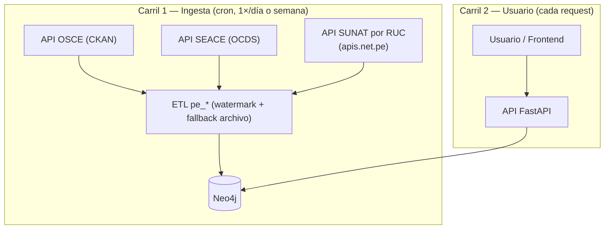

# Plan — Automatización de ingesta y visibilidad de frescura

> **Tipo:** documento de diseño (handoff Planner → Developer).
> **Rama:** `feat/data`.
> **Estado:** aprobado para desarrollo. Este doc es la fuente de verdad; la sesión de
> desarrollo trabaja **solo** con lo que está aquí. Si algo falta, se vuelve a este doc,
> no se improvisa.

## 1. Contexto y problema

Hoy toda la data se carga **a mano**: alguien descarga un CSV de un portal público,
lo deja en `data/raw/pe/<fuente>/` y corre `make etl-pe-<fuente>`. Esto tiene tres
problemas para escalar a nivel nacional:

1. **Manual y frágil** — depende de que una persona baje archivos periódicamente.
2. **Sin frescura visible** — el usuario no sabe de cuándo son los datos ni qué fuentes
   están cargadas.
3. **Costo de Neo4j** — cargar todo el padrón SUNAT (~11M RUC) haría el grafo enorme.

El proyecto es **nacional** (no un piloto regional). El costo se controla por **relación
con el Estado**, no por región.

## 2. Objetivo

- Reemplazar la descarga manual por **ingesta automática por API** (donde exista API),
  ejecutada por un **scheduler** (cron), sin intervención humana.
- Cargar en el grafo **solo lo relevante** (proveedores con al menos una relación con el
  Estado) → grafo chico, costo bajo.
- Exponer la **frescura y el estado de fuentes** en el frontend, que es donde el cambio
  se ve.

## 3. Alcance

**Dentro:**
- ETL: modo API para OSCE (CKAN) y SEACE (OCDS), con `watermark` incremental y
  fallback a archivo.
- Enriquecimiento de identidad SUNAT por RUC (solo proveedores ya en el grafo).
- Regla de tamaño: `Provider` sin relación no se persiste.
- Scheduler de sincronización.
- Backend: exponer frescura (`last_sync`) y estado por fuente.
- Frontend: indicador de última actualización + panel de estado de fuentes + link de
  fuente (`source_url`) en la sanción.
- Arreglar `source_url` vacío en sanciones (trazabilidad).

**Fuera (otra iteración):**
- MEF / nodo presupuestal.
- Rebrand interno `bracc` → `pe`.
- Limpieza de pipelines heredados de Brasil.

## 4. Arquitectura — dos carriles

La API externa vive **solo en la ingesta** (background). El usuario **nunca** la toca:
lee siempre de Neo4j local.

- **Latencia al usuario:** cero. La API externa no está en su request.
- **Dependencia de proveedores:** solo durante el sync. Si una API falla, se reintenta
  en la próxima corrida; el grafo sigue sirviendo la última data cargada. Fallback a
  archivo disponible.

## 5. Cambios por capa

> El orden A–F es un **catálogo por capa**, no la secuencia de trabajo. El **orden de
> ejecución real está en §7 (Plan por fases)**: F (trazabilidad) → A/OSCE → B → D+E →
> A/SEACE → C. Empezar por §7, no por la letra A.

### A. ETL — ingesta por API

Para cada pipeline `pe_*`, agregar un **modo fuente** configurable: `api` o `file`
(el modo `file` actual se mantiene como fallback).

- **OSCE (`pe_osce_sanctions`)** — `GET {portal}/api/3/action/datastore_search`
  con `resource_id`, `limit`, `offset` (paginación). Mapear el JSON a los campos que el
  pipeline ya normaliza (`sanction_id`, `ruc`, `type`, `reason`, `status`, fechas).
  Dataset chico → refresco completo por corrida.
- **SEACE (`pe_seace_conosce`)** — API OCDS (`releases`/`records`) con filtro
  `publishedFrom = <watermark>` y paginación por `next`. Mapear al modelo
  `Entity / ProcurementProcess / Award` y sus relaciones.
- **SUNAT (`pe_sunat_ruc`)** — **no bulk**. Nuevo paso de **enriquecimiento**: para cada
  RUC que ya entró al grafo vía OSCE/SEACE y no tiene identidad, llamar 1 vez a
  `apis.net.pe` (backend-only, con token en env var) y escribir las propiedades de
  identidad en el nodo `Provider`. Cachear/registrar para no repetir.

**Watermark:** el nodo `IngestionRun` **ya se escribe en cada corrida** desde
`etl/src/bracc_etl/base.py` (MERGE con `source_id`, `status`, `started_at`,
`finished_at`, `rows_in`, `rows_loaded`, `error`). El watermark se resuelve consultando
el último `IngestionRun` por `source_id`. Falta agregar una propiedad de **fecha de dato**
(p. ej. `data_watermark` = máxima fecha de publicación ya ingerida) para el incremental
preciso por `publishedFrom`; si no, `finished_at` sirve como aproximación. No hay que
crear el nodo desde cero — solo leerlo y extenderlo.

**Idempotencia:** los pipelines ya cargan con `MERGE` (upsert por clave). **No** se borra
ni se recarga todo — re-correr solo agrega/actualiza. Prohibido truncate + reload.

### B. Regla de tamaño

- `Provider` se persiste **solo si participa en al menos una relación** (`HAS_SANCTION`,
  `WINNER`). Un RUC sin relación con el Estado no entra al grafo.
- SUNAT deja de ser carga masiva → pasa a enriquecer los `Provider` que ya existen.
- **Gap confirmado:** hoy `Provider(ruc)`, `Entity(entity_id)`, `ProcurementProcess(process_id)`
  y `Award(award_id)` **no tienen constraint de unicidad ni índice de lookup** en
  `api/src/bracc/queries/schema_init.cypher` (solo aparecen en un índice fulltext de
  búsqueda). Sin índice por `ruc` — que es la clave de unión — el `MERGE` es lento y puede
  duplicar bajo concurrencia. Agregar las constraints únicas (como ya existe
  `sanction_sanction_id_unique`). `schema_init.cypher` se corre solo en el arranque de la
  API (`neo4j_service.py`, idempotente con `IF NOT EXISTS`).

### C. Scheduler

El sync corre **en el mismo host que el stack** (el servidor/VPS donde vive el
`docker-compose`). Debe ser así porque Neo4j está atado a `127.0.0.1` por seguridad:
un runner externo (p. ej. GitHub Actions) **no** puede alcanzarlo sin exponer la base a
internet. El scheduler co-locado corre dentro de la red del stack y llega a Neo4j sin
exponerlo.

Dos opciones (elegir en desarrollo):

- **Servicio `etl` en el `docker-compose.yml` (recomendado):** un contenedor con
  scheduler (cron interno u orquestador tipo `ofelia`) que corre junto a Neo4j y se
  levanta con el resto del stack.
- **Cron del host:** una entrada `cron` en el VPS que ejecuta
  `docker compose run --rm etl <target>`.

En ambos casos el job corre la cadena: leer watermark → ingerir OSCE + SEACE →
enriquecer SUNAT → registrar `IngestionRun` con timestamp y conteos.

- Determinístico: **cron, no agente LLM**. Un agente solo se justificaría para tareas
  difusas (detectar cambio de esquema/URL, matching de nombres) — fuera de este alcance.
- Reintentos + registro de fallos por fuente.
- **GitHub Actions** queda reservado solo para CI (tests en cada PR), **no** para el
  sync de datos.

### D. Backend / API

- Exponer **frescura** en `/api/v1/meta/stats` y/o `/api/v1/public/meta`:
  agregar `last_sync` por fuente (desde `IngestionRun`) y el `load_state` (ya disponible
  vía `source_registry` service).
- Nuevo campo por fuente: `{ source_id, load_state, last_sync, record_count }`.
- Archivos: `api/src/bracc/routers/meta.py`, `api/src/bracc/routers/public.py`,
  `api/src/bracc/services/source_registry.py`, `api/src/bracc/queries/meta_stats.cypher`.

### E. Frontend — dónde se ve el cambio

Esta capa es la que hace visible la automatización:

1. **Indicador de última actualización** — en `StatusBar`
   (`frontend/src/components/common/StatusBar.tsx`, hoy solo muestra `nodeCount`).
   Mostrar "Actualizado: <fecha>" leyendo `last_sync` del meta.
2. **Panel / badges de estado de fuentes** — en `Dashboard`
   (`frontend/src/pages/Dashboard.tsx`): por cada fuente (SUNAT, OSCE, SEACE), mostrar
   estado (`cargado` / `parcial` / `vacío`), fecha de última carga y conteo. Reusar
   `SourceBadge` (`frontend/src/components/common/SourceBadge.tsx`).
3. **Link de fuente en la sanción** — en `NodeTooltip`
   (`frontend/src/components/graph/NodeTooltip.tsx`): cuando la sanción tenga `source_url`,
   mostrar "Fuente" como enlace clickeable. Hoy el tooltip ya muestra tipo/motivo/estado
   pero **no** el link (porque el dato viene vacío — ver capa F).
4. Cliente API: `frontend/src/api/client.ts` para consumir los nuevos campos del meta.

### F. Trazabilidad — arreglar `source_url` (rápido, alto impacto)

Hoy `pe_osce_sanctions.py` guarda `source_url: ""` hardcodeado
(`etl/src/bracc_etl/pipelines/pe_osce_sanctions.py`, dicts `provider` y `sanction`).
Poblar `source_url` con la URL real de la fuente (del `source_registry` o del dataset).
Sin esto, el punto E.3 no tiene qué mostrar y la promesa de "trazabilidad" queda rota.

## 6. Modelo de datos afectado

- `IngestionRun` ya se escribe por corrida desde `base.py` con
  `{ run_id, source_id, status, started_at, finished_at, rows_in, rows_loaded, error }`.
  Se extiende con `data_watermark` (fecha máxima de dato ingerido) para el incremental.
- `Provider`, `Sanction`, `Entity`, `ProcurementProcess`, `Award`: sin cambios de
  propiedades; se agregan **constraints únicas** (ver 5.B) y se puebla `source_url` en
  `Sanction`/`Provider`.
- Ver modelo completo en [modelo-datos.md](modelo-datos.md).

## 7. Plan por fases

1. **F1 — Trazabilidad (chico, seguro):** poblar `source_url` en sanciones + mostrar link
   en `NodeTooltip`. No requiere data nueva.
2. **F2 — OSCE archivo → API (CKAN):** modo `api` + fallback. Banco de pruebas seguro
   (OSCE ya funciona).
3. **F3 — Regla de tamaño + índices:** `Provider` solo con relación; enriquecimiento
   SUNAT por RUC; índices Neo4j.
4. **F4 — Backend frescura + Frontend estado de fuentes:** `last_sync`, panel Dashboard,
   indicador StatusBar.
5. **F5 — SEACE por OCDS API + watermark:** el pipeline grande que falta.
6. **F6 — Scheduler:** cron que orquesta todo lo anterior.

## 8. Criterios de aceptación

- Correr el sync sin descargar archivos a mano deja los mismos (o más) nodos que la carga
  manual actual.
- Re-correr el sync es idempotente (no duplica, no borra).
- El usuario ve en el frontend: última actualización, estado por fuente, y link de fuente
  clickeable en una sanción.
- Un `Provider` sin relación con el Estado no aparece en el grafo.
- Si una API externa está caída, el sync falla con log claro y el frontend sigue sirviendo
  la última data.
- `make agent-check-full` pasa (lint, tipos, tests, neutralidad, claims públicos, URLs).

## 9. Riesgos y mitigaciones

| Riesgo | Mitigación |
|---|---|
| API externa caída o lenta | Corre en background; reintentos; fallback a archivo; grafo sirve última data |
| Cambio de esquema/URL en la fuente | Log claro por fuente; modo archivo como respaldo |
| Rate limit de apis.net.pe en backfill inicial | Throttle; backfill por lotes; solo RUC con relación (~10⁵, no 11M) |
| Límite de paginación en OCDS/CKAN | Paginar por `offset`/`next`; watermark para reanudar |
| `MERGE` sin índice = lento a escala | Crear índices por clave antes de cargas grandes |

## 10. Mapa de archivos a tocar (para el Developer)

**ETL**
- `etl/src/bracc_etl/pipelines/pe_osce_sanctions.py` — modo API + `source_url`
- `etl/src/bracc_etl/pipelines/pe_seace_conosce.py` — modo API OCDS + watermark
- `etl/src/bracc_etl/pipelines/pe_sunat_ruc.py` — enriquecimiento por RUC
- `etl/src/bracc_etl/runner.py` — registro/orquestación
- (nuevo) cliente HTTP compartido para CKAN/OCDS/apis.net.pe
- `Makefile` — targets de sync
- `etl/tests/` — fixtures y tests por pipeline (ya existen para los 3 pe_*)

**Backend**
- `api/src/bracc/routers/meta.py`, `api/src/bracc/routers/public.py`
- `api/src/bracc/services/source_registry.py`
- `api/src/bracc/queries/meta_stats.cypher`, `api/src/bracc/queries/schema_init.cypher`

**Frontend**
- `frontend/src/components/common/StatusBar.tsx` — indicador de frescura
- `frontend/src/pages/Dashboard.tsx` — panel de estado de fuentes
- `frontend/src/components/common/SourceBadge.tsx` — badges por fuente
- `frontend/src/components/graph/NodeTooltip.tsx` — link `source_url` en sanción
- `frontend/src/api/client.ts` — consumir nuevos campos del meta

**Config / infra**
- `docker-compose.yml` — servicio `etl` con scheduler co-locado (o cron del host)
- `.env.example` — token de `apis.net.pe`, `resource_id` OSCE, base URL OCDS
- `docs/source_registry_pe_v1.csv` — mantener `load_state` / `last_seen_url`

## 11. Decisiones tomadas (no re-abrir sin motivo)

- Proyecto **nacional**, no piloto regional.
- Selección por **relación con el Estado**, no por región.
- Refresco por **`MERGE`/upsert**, no truncate + reload.
- API en **ingesta** (background), nunca en el request del usuario.
- Automatización por **cron determinístico**, no agente LLM.

## 12. Preguntas abiertas (verificar en desarrollo)

- `resource_id` exacto del dataset OSCE de sanciones en datosabiertos.gob.pe.
- Límites de rate / auth del plan gratuito de `apis.net.pe` (dimensionar backfill).
- Tope de paginación / auth de la API OCDS de OSCE.
- ~~¿`IngestionRun` alcanza para el watermark?~~ **Resuelto:** ya se escribe por corrida
  en `base.py`; solo falta agregarle `data_watermark`. Ver 5.A.
- Definir el `run_id` por fuente para poder consultar "último run de OSCE/SEACE/SUNAT"
  (hoy `run_id` es `<source_id>_manual` cuando no se setea).
