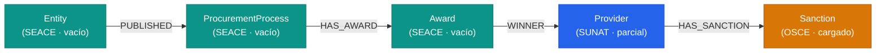

# Modelo de datos — PE-ACC

Este documento describe cómo se organiza la información en el grafo de Neo4j:
qué **nodos** existen, qué **relaciones** los conectan, de qué **fuente** viene cada uno
y en qué **estado de carga** está hoy.

> Neo4j es una base de **grafo**, no relacional. No hay "tablas": hay **nodos**
> (equivalente a filas/entidades) y **relaciones** (aristas con nombre y dirección).

## Diagrama

`Provider` es el **nodo pegamento**: todas las fuentes caen sobre él a través del
`RUC` (11 dígitos). SUNAT le da identidad, OSCE le cuelga sanciones y SEACE le
cuelga contratos ganados.

## Nodos

### Provider — fuente: SUNAT (carga parcial)

Identidad del proveedor. Lo crea SUNAT, pero también lo pueden crear OSCE o SEACE
si aparece un RUC que aún no existe (luego SUNAT lo enriquece).

| Propiedad | Descripción |
|---|---|
| `ruc` *(PK)* | RUC de 11 dígitos. Clave de unión entre todas las fuentes. |
| `legal_name` | Razón social. |
| `name` | Alias de `legal_name`. |
| `trade_name` | Nombre comercial. |
| `tax_status` | Estado del contribuyente (activo, baja, etc.). |
| `tax_condition` | Condición (habido / no habido). |
| `provider_type` | Tipo de proveedor. |
| `ubigeo` | Código de ubicación geográfica (6 dígitos). |
| `department` / `province` / `district` | Ubicación. |
| `source`, `source_url`, `source_dataset`, `extraction_date` | Trazabilidad. |

### Sanction — fuente: OSCE (cargado)

Inhabilitación vigente de un proveedor. Puede venir del Tribunal de Contrataciones
o de un mandato judicial.

| Propiedad | Descripción |
|---|---|
| `sanction_id` *(PK)* | Nº de resolución, o id derivado si no hay. |
| `ruc` | RUC del proveedor sancionado. |
| `provider_name` | Nombre del proveedor. |
| `type` | `TRIBUNAL_CONTRATACIONES` o `MANDATO_JUDICIAL`. |
| `reason` | Motivo de la infracción / órgano jurisdiccional. |
| `status` | Estado (VIGENTE). |
| `sanction_source` | `OSCE_TCP` o `PODER_JUDICIAL`. |
| `sanction_scope` | Alcance (vigente). |
| `date_start` / `date_end` | Vigencia. |
| `resolution_number` | Nº de resolución. |
| `source`, `source_dataset`, `source_url`, `extraction_date` | Trazabilidad. |

### Entity — fuente: SEACE (sin datos)

Entidad pública que convoca contrataciones.

| Propiedad | Descripción |
|---|---|
| `entity_id` *(PK)* | Identificador de la entidad. |
| `name` | Nombre de la entidad. |
| `government_level` | Nivel de gobierno (nacional, regional, local). |
| `sector` | Sector. |
| `ubigeo` | Ubicación (6 dígitos). |
| `source`, `source_url`, `extraction_date` | Trazabilidad. |

### ProcurementProcess — fuente: SEACE (sin datos)

Proceso de selección / convocatoria.

| Propiedad | Descripción |
|---|---|
| `process_id` *(PK)* | Identificador del proceso. |
| `seace_code` | Código SEACE. |
| `title` | Título. |
| `object` | Objeto de la contratación. |
| `selection_method` | Método de selección. |
| `status` | Estado del proceso. |
| `call_date` | Fecha de convocatoria. |
| `source`, `source_url`, `extraction_date` | Trazabilidad. |

### Award — fuente: SEACE (sin datos)

Adjudicación (quién ganó y por cuánto).

| Propiedad | Descripción |
|---|---|
| `award_id` *(PK)* | Identificador de la adjudicación. |
| `award_title` | Título de la adjudicación. |
| `award_date` | Fecha. |
| `amount` | Monto adjudicado. |
| `provider_ruc` | RUC del proveedor ganador. |
| `source`, `source_url`, `extraction_date` | Trazabilidad. |

## Relaciones

| Relación | Origen → Destino | Fuente | Propiedades |
|---|---|---|---|
| `HAS_SANCTION` | `Provider` → `Sanction` | OSCE | `source`, `confidence` |
| `PUBLISHED` | `Entity` → `ProcurementProcess` | SEACE | `source` |
| `HAS_AWARD` | `ProcurementProcess` → `Award` | SEACE | `source` |
| `WINNER` | `Award` → `Provider` | SEACE | `source`, `confidence` |

## Estado de carga (a la fecha)

| Nodo / relación | Pipeline | Código | Datos cargados |
|---|---|---|---|
| `Provider` | `pe_sunat_ruc` | ✅ | ⚠️ parcial |
| `Sanction` + `HAS_SANCTION` | `pe_osce_sanctions` | ✅ | ✅ sí |
| `Entity` / `Process` / `Award` + relaciones | `pe_seace_conosce` | ✅ (esqueleto) | ❌ no |
| Presupuesto (MEF) | — | ❌ no existe | ❌ no |

## Clave de unión

Todas las fuentes se cruzan por el **`RUC` de 11 dígitos**. Los pipelines validan
`len(ruc) == 11` y descartan cualquier fila que no cumpla. Por eso `Provider` es el
nodo central del grafo.

## Pendiente de discusión

- Ingesta incremental por API (OSCE OCDS, CKAN `datastore_search`) en lugar de
  descarga manual de archivos.
- Regla de tamaño: cargar solo proveedores con al menos una relación con el Estado,
  para no meter los ~11M de RUC del padrón SUNAT.
- Enriquecimiento de identidad por RUC vía API (p. ej. apis.net.pe) en la ingesta.
- Nodo `Budget`/`Entity` alimentado por MEF (fase posterior).
